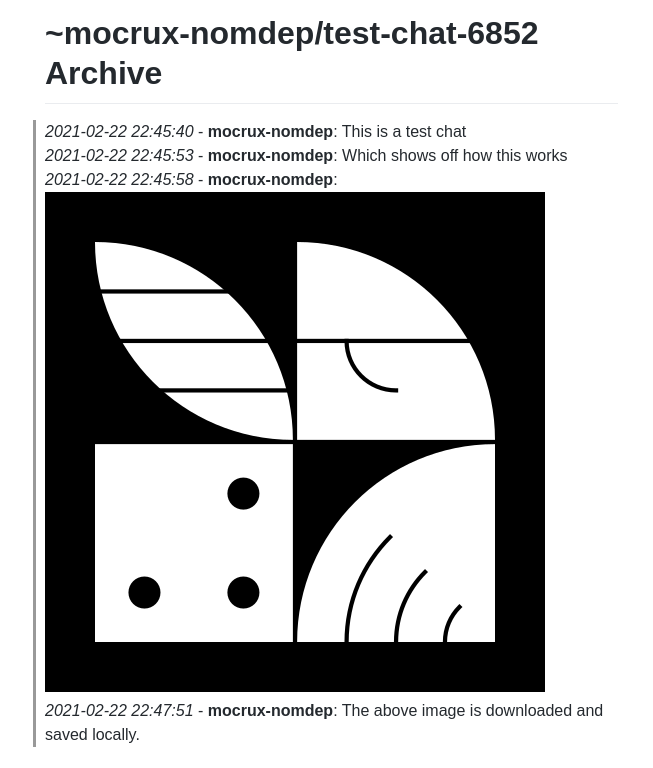

The Urbit Content Archiver is a small CLI application that exports channels from your Urbit ship and auto-downloads any linked media content locally in order to preserve and archive the content for the future.

This application uses the [Rust Urbit HTTP API Crate](https://crates.io/crates/urbit-http-api).

## Using The Urbit Content Archiver

```
Usage:
        urbit-content-archiver chat <chat-ship> <chat-name> [--config=<file_path> --output=<folder_path>]
Options:
      --config=<file_path>  Specify a custom path to a YAML ship config file.
      --output=<folder_path>  Specify a custom path where the output file will be saved.

```

As can be seen above, the Urbit Content Archiver is quite straightforward to use. It uses a non-interactive interface in order to allow it to be interoperable with other tools/applications. This allows for setting up cron-jobs to say archive a chat every X hours, setup hotkeys to do it on-command, or anything you can imagine in between.

## Current Supported Commands & Flags

### `chat`



This command allows you to export and archive any chat which your ship has joined as a mardown file. Any media files that are linked to in the chat will be automatically downloaded locally and linked within the markdown as well.

It can be used as such:

```sh
./urbit-content-archiver chat ~darrux-landes development
```

The chat graph will be requested from your ship (may take a number of seconds for your ship to process the request depending on chat size), and then once received, processed into a clean markdown formatting style as seen above (do note the above is a processed preview from the markdown).

The markdown chat archive is saved locally as `<ship>-<name>.md` and the downloaded media files are stored in the `archived-content` folder.

### `--config=<file_path>`

This flag allows you to specify which ship config yaml file to use via file path. This and other flags can be useful for many circumstances, such as setting up a cron job.

### `--output=<folder_path>`

This flag allows you to specify the output folder path where the archived data will be saved.

## Building The Application

Ensure that you have the [latest version of Rust installed](https://rustup.rs/) and the `libssl-dev` package on Ubuntu (aka `openssl-devel` on Fedora, and potentially slightly different on other distros).

1. Clone this repository and enter into the folder.

2. Run the setup script which will compile and prepare everything for you.

```sh
sh setup.sh
```

3. The Urbit Content Archiver application will be compiled, moved into the `deployed` folder, and begin using the application.

4. Use the archiver:

```sh
./urbit-content-archiver chat ~darrux-landes development
```

5. If you haven't specified one already, the `ship_config.yaml` will be automatically generated for you and will require editing to add your Urbit ship's ip/port/`+code`.
